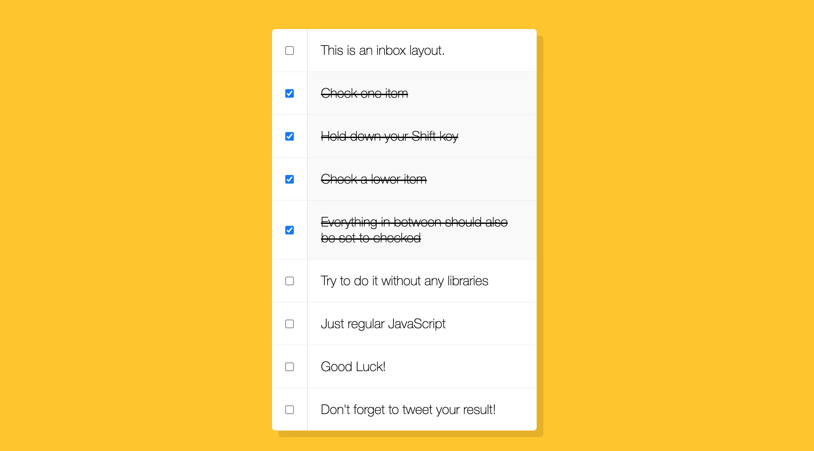

# Hold Shift to Check Checkboxes

Day 10 of Javascript30 by WesBos. Made a To-do-Checklist, where you can check multiple checkboxes while holding down shift.

# Demo

# Technologies Used

HTML5, CSS, Vanilla JS

# Website

https://buigabor.github.io/hold-shift-to-check-checkboxes/
